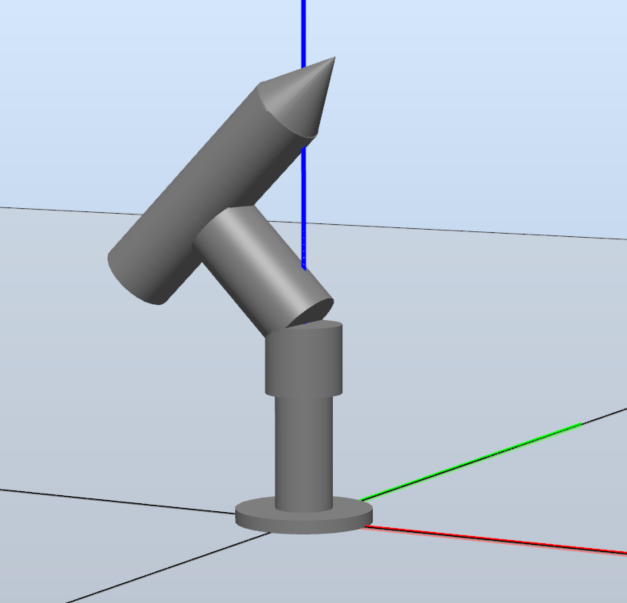
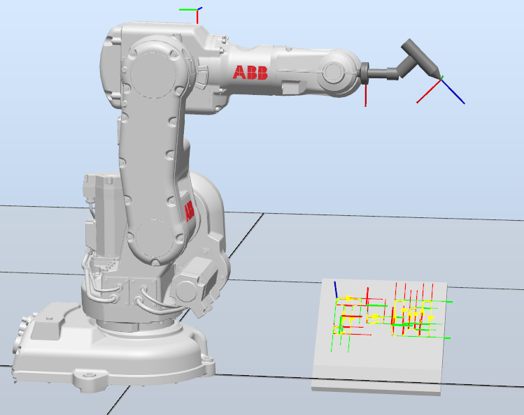
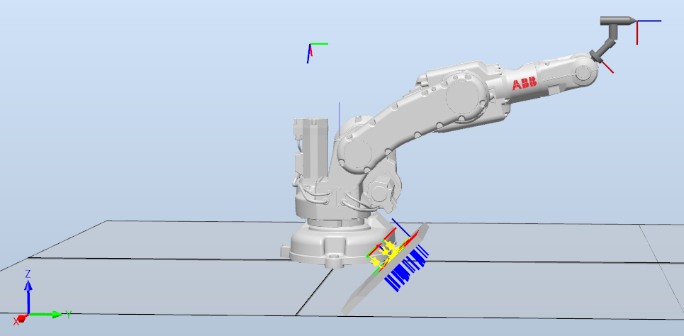
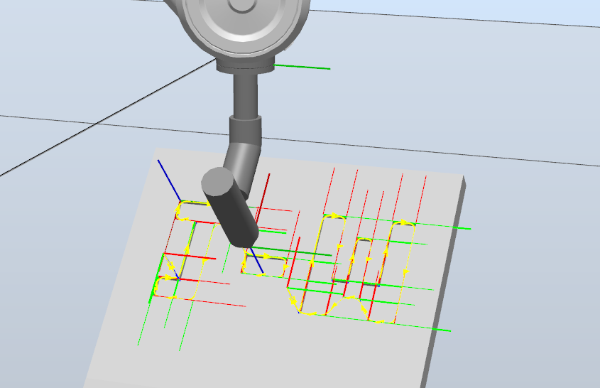

# Entrega Laboratorio 3

El laboratorio N°.03 de la asignatura de robótica tiene como objetivo la implementación del modulo de entradas y salidas dispuestos en el controlador IRC5 del manipulador IRB 140 del laboratorio LabSIR de la Universidad Nacional de Colombia, y  además, utilizar diferentes funciones de RAPID.

## Autores

- [Wilder Ofrey Bello Herrera](https://github.com/WilderBello)
- [Javier Eduardo Gutierrez Serrano](https://github.com/jaegutierrezser)

## Solución

Tomando como base de trabajo la herramienta diseñada y modelada del laboratorio N°.01, la cual tiene una inclinación de 45 grados, de tal manera que al bajar el manipulador no se choqué con el tablero.

En la imagen anterior se aprecia el modelo realizado de la herramienta empleada en RobotStudio, y a continuación se aprecia la herramienta construida física.

## Archivos

Para el desarrollo del presente trabajo se emplea la base usada en el laboratorio N°.01, la cual se aprecia a continuación.

Se ubican el punto de HOME, la cual corresponde a la posición de referencia 0 del robot (todos los ángulos de articulaciones del manipulador son 0).

A demás se implementa la posición de mantenimiento, la cual es la pose en la que permite el cambio de herramienta del manipulador.

Por último, se realiza la ubicación de las trayectorias que debe seguir el robot, para así obtener el código en RAPID de la secuencia requerida para la solución de la rutina requerida en el laboratorio.

Por medio de la implementación de las trayectorias que sigue el manipulador ABB, se realiza la respectiva programación del codigo en RAPID, el cual, se implementa en el Robot real.

- [Codigo RAPID - Secuencia Lab N°03](https://github.com/WilderBello/Robotica_Laboratorio_3/tree/main/Codigo%20RAPID_Lab_03_Robotica)

## Rutina Planteada

![]
![]
![]

<iframe width="560" height="315" 
src="https://www.youtube.com/embed/Uu5_FPIJ8n0" 
title="YouTube video player" 
frameborder="0" 
allow="accelerometer; autoplay; clipboard-write; encrypted-media; gyroscope; picture-in-picture" 
allowfullscreen></iframe>

